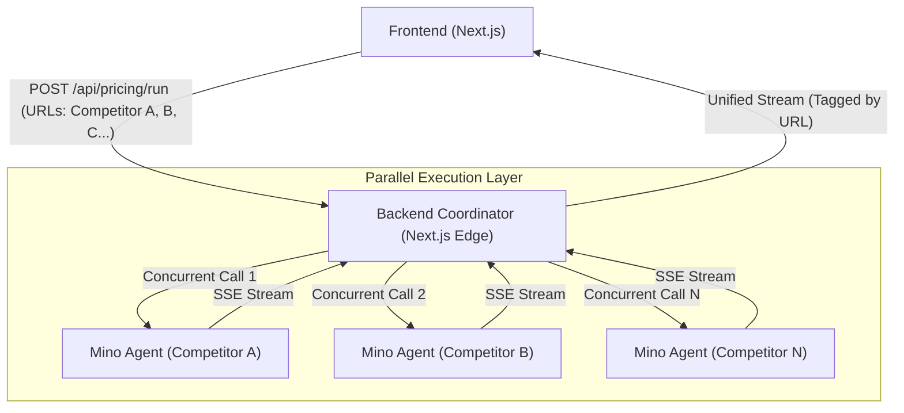
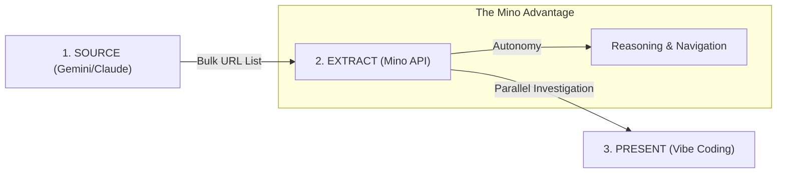

# Mino API Use Cases: Intelligent Automation Library

This repository contains high-value, production-ready use cases built with the **Mino API**. These agents demonstrate advanced reasoning, scale, and complexity in browser-based automation.

> **One-Paragraph Pitch**: The Inventory Risk & Integrity Agent is an AI-driven browser automation agent that continuously monitors inventory management systems, detects risky or anomalous stock updates, and decides whether to proceed, pause, or escalate actions based on confidence and business context. Unlike traditional trigger-based automation, the agent prioritizes correctness and loss prevention over speed.

---

## The Core Problem
Inventory systems are often updated manually, via voice, or by non-technical staff. A single incorrect update can cause stockouts, over-ordering, revenue loss, and broken trust.

Traditional automation fails because it:
- Blindly executes commands
- Lacks reasoning
- Has no verification or escalation logic

**Key Insight**: Not all automation should execute. Some should decide **not to act**.

---

## Feature Showcases

### 1. Inventory Risk & Integrity Auditor
An AI-driven agent that monitors inventory systems, detects risky stock updates, and decides whether to proceed, pause, or escalate.

### 2. Competitive Pricing-at-Scale (New)
A strategic analyst that monitors 10+ competitors in parallel to extract pricing models, unit economics, and competitive standing.

---

## Technical Architecture (Scale & Parallelism)

The platform is designed to handle complex, multi-site automation by leveraging Mino's ability to run parallel browser sessions.



### The 3-Step "Mino" Workflow



### The Mino Rules Followed:
- **The Scale Rule**: We avoid single-site extraction. Our pricing agent is designed to hit 50+ niche sites simultaneously, a task impossible for manual review or single-threaded bots.
- **The Complexity Rule**: The agent handles "The Boss Fight" sites—pricing pages with dynamic toggies (Monthly/Annual), nested expansion menus (Feature Tables), and hidden tooltips.

---

## Standard Developer Documentation: Pricing Intelligence

### 1. Product Architecture Overview
The system uses a **Coordinator-Agent Architecture**. The backend receives a bulk list of URLs and instantiates an autonomous Mino researcher for each.
- **APIs Called**: `https://mino.ai/v1/automation/run-sse`
- **Parallelism**: 10-20 concurrent sessions.
- **Orchestration**: Node.js controller merges individual agent streams into a single event-source for the frontend.

### 2. Code Snippet (Execution)
```javascript
// Example of parallel orchestration in Next.js
export async function POST(req) {
  const { urls } = await req.json();
  const streams = urls.map(url => runMinoAgent(url, pricingGoal));
  
  return new Response(mergeStreams(streams), {
    headers: { "Content-Type": "text/event-stream" }
  });
}
```

### 3. Goal (Prompt Strategy)
We use a high-context "Strategist" persona to ensure the agent understands unit economics, not just raw numbers.

> **Prompt**: "You are a senior Strategic Pricing Analyst. Your mission is to extract the exact pricing model for [URL]. Identify if they charge per seat, per token, or per unit. Find the entry-level price and the 'Pro' tier price. Normalize the cost to 1,000 operations."

### 4. Sample Output
```json
{
  "competitor_name": "AgentFlow",
  "pricing_model": "CONSUMPTION",
  "tiers": [
    { "name": "Free", "price": 0, "unit": "100 runs" },
    { "name": "Pro", "price": 49, "unit": "1000 runs" }
  ],
  "unit_cost_normalized": { "amount": 0.049, "unit_description": "per run" }
}
```

---

## Tech Stack
- **Frontend**: Next.js 14, React, Tailwind CSS, Lucide Icons
- **Backend**: Next.js API Routes (SSE Streaming)
- **Agent**: Mino API (Browser Automation)
- **Design**: Premium Dark Aesthetic with Glassmorphism

---

## How it Works (Mino Integration)
Mino is critical because legacy inventory dashboards often lack public APIs. Mino allows:
1. **Stealth browser access**
2. **Visual + DOM understanding**
3. **Natural language goals**
4. **Real-time observability via SSE**

### Example Mino API Call
```bash
curl -N -X POST "https://mino.ai/v1/automation/run-sse" \
  -H "X-API-Key: $MINO_API_KEY" \
  -H "Content-Type: application/json" \
  -d '{
    "url": "https://inventory-demo-dashboard.com",
    "goal": "Evaluate whether updating SKU-142 stock from 120 → 20 units is safe",
    "browser_profile": "stealth"
  }'
```

---

## Getting Started

1. Clone the repository
2. Install dependencies: `npm install`
3. Add your `MINO_API_KEY` to `.env.local`
4. Run the development server: `npm run dev`
5. Open [http://localhost:3000](http://localhost:3000)

---

## "Correctness-First" Philosophy
This agent is designed to **not act** when uncertainty is high. It prioritizes the integrity of the inventory system over the speed of automation.

*"Automation with judgment."*
